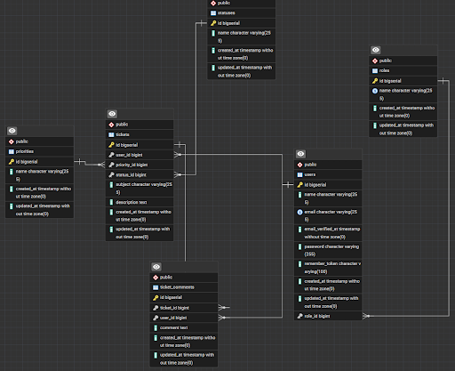

**High-Level Architecture**
- Frontend - AlpineJS, TailwindCSS, Livewire
- Backend API - Laravel
- Database - PostgreSQL

**Database Design (ER Diagram)**
**Required tables:**
- users
- roles
- tickets
- ticket_comments
- priorities
- statuses  

**API List**
- Endpoint - 
- HTTP Method - (POST, PATCH)
- Purpose - The POST method is used to upload/add data to the database, The Patch Method is useed to update the status of the ticket.

**Mockup Design**
https://www.figma.com/design/7GppARiM42LVWkp1fIsGoL/Untitled?node-id=0-1&t=NE8gZQGdSbwePlEv-1